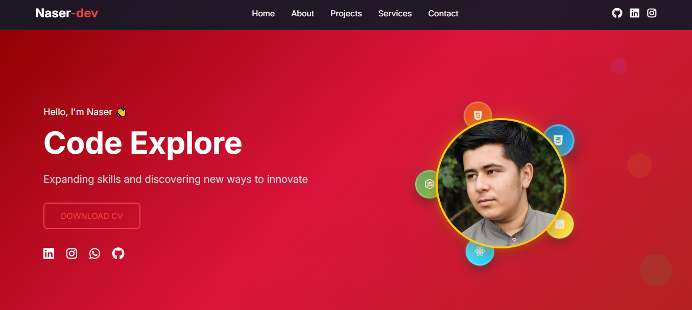
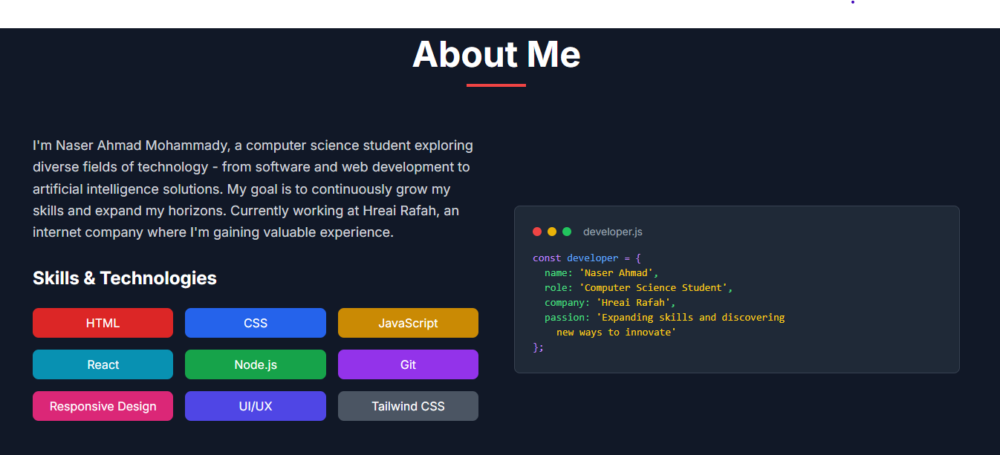
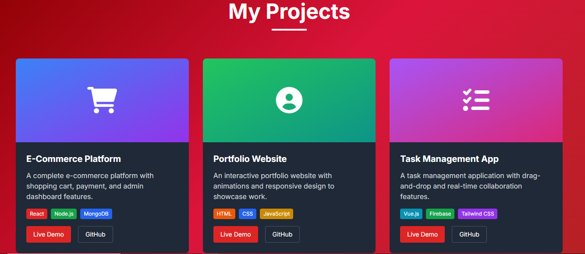
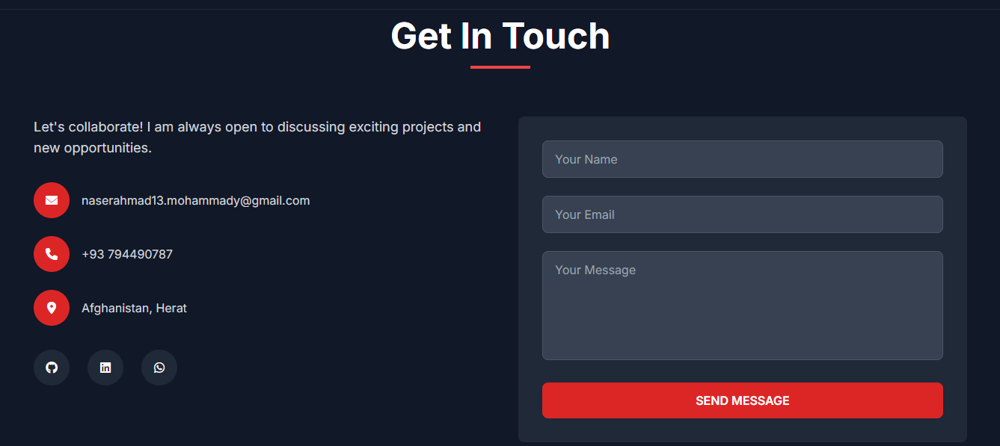

# 🚀 Naser Ahmad Mohammady - Portfolio Website

A modern, responsive portfolio website showcasing my skills as a Computer Science Student and Front End Developer.


## 📸 Preview

<div align="center">
  
### 🏠 Home Section


### 👨‍💻 About Section


### 🚀 Projects Section


### 📞 Contact Section


</div>

## 🌟 Features

- **Modern Design**: Clean, professional layout with smooth animations
- **Responsive**: Fully responsive design that works on all devices
- **Interactive Elements**: Animated typewriter effect, orbiting skill icons, and hover effects
- **Contact Form**: Functional contact form that opens email client
- **CV Download**: One-click CV download functionality
- **Services Section**: Showcase of development services offered

## 🛠️ Technologies Used

- **HTML5**: Semantic markup and structure
- **Tailwind CSS**: Modern utility-first CSS framework
- **JavaScript**: Interactive functionality and animations
- **Font Awesome**: Professional icons
- **Google Fonts**: Inter font family for clean typography

## 📱 Sections

### 🏠 Home
- Animated introduction with typewriter effect
- Professional avatar with orbiting skill icons
- Social media links and CV download

### 👨‍💻 About
- Personal introduction and background
- Skills showcase with interactive tags
- Code snippet display

### 🚀 Projects
- Featured project portfolio
- Technology stack for each project
- Live demo and GitHub links

### 🔧 Services
- Web Development
- App Development
- Digital Marketing
- Email Marketing

### 📞 Contact
- Contact information
- Interactive contact form
- Social media links

## 🎨 Key Features

### Animated Elements
- **Typewriter Effect**: Rotating text animation showing different roles
- **Orbiting Icons**: Skill icons that orbit around the profile picture
- **Smooth Scrolling**: Seamless navigation between sections
- **Hover Effects**: Interactive elements with smooth transitions

### Responsive Design
- Mobile-first approach
- Optimized for all screen sizes
- Touch-friendly navigation
- Adaptive layouts

## 📧 Contact Information

- **Email**: naserahmad13.mohammady@gmail.com
- **Phone**: +93 794490787
- **WhatsApp**: +93 794490787
- **GitHub**: [@Naser-frontend](https://github.com/Naser-frontend)
- **LinkedIn**: [naser-ahmad-mohammady](https://linkedin.com/in/naser-ahmad-mohammady)
- **Telegram**: [@NASER_AHMAD-MOHAMMADY](https://t.me/NASER_AHMAD-MOHAMMADY)
- **Fiverr**: [@naser_ahmad_m](https://www.fiverr.com/naser_ahmad_m)

## 🏢 Current Position

Working at **Hreai Rafah** - Internet Company

## 🎓 Education

- **Computer Science Student**
- **Herat Provincial Technical Institute**
- **Computer Programming Student**

## 💼 Skills

### Programming & Web Development
- HTML (Advanced)
- CSS (Advanced)  
- JavaScript (Basic)
- React
- Node.js
- Tailwind CSS
- Responsive Design
- UI/UX Design

### Database & Backend
- PHP (Basic)
- MySQL
- SQL Server
- Oracle Database
- MongoDB
- Database Design
- ERD Modeling

### Computer Skills
- Microsoft Office Suite
- Windows Operating System
- Git & Version Control
- Fast Typing (Persian & English)

## 🌍 Languages

- **Dari** (Native)
- **English** (Advanced)

## 🚀 Getting Started

1. **Clone the repository**
   ```bash
   git clone https://github.com/Naser-frontend/portfolio-website.git
   ```

2. **Navigate to project directory**
   ```bash
   cd portfolio-website
   ```

3. **Open in browser**
   ```bash
   # Simply open index.html in your preferred browser
   # Or use a local server like Live Server in VS Code
   ```


## ⭐ Show Your Support

Give a ⭐️ if you like this project!

---

<div align="center">


*Expanding skills and discovering new ways to innovate*

[](https://github.com/Naser-frontend)
[](https://linkedin.com/in/naser-ahmad-mohammady)
[](https://www.fiverr.com/naser_ahmad_m)

</div>
